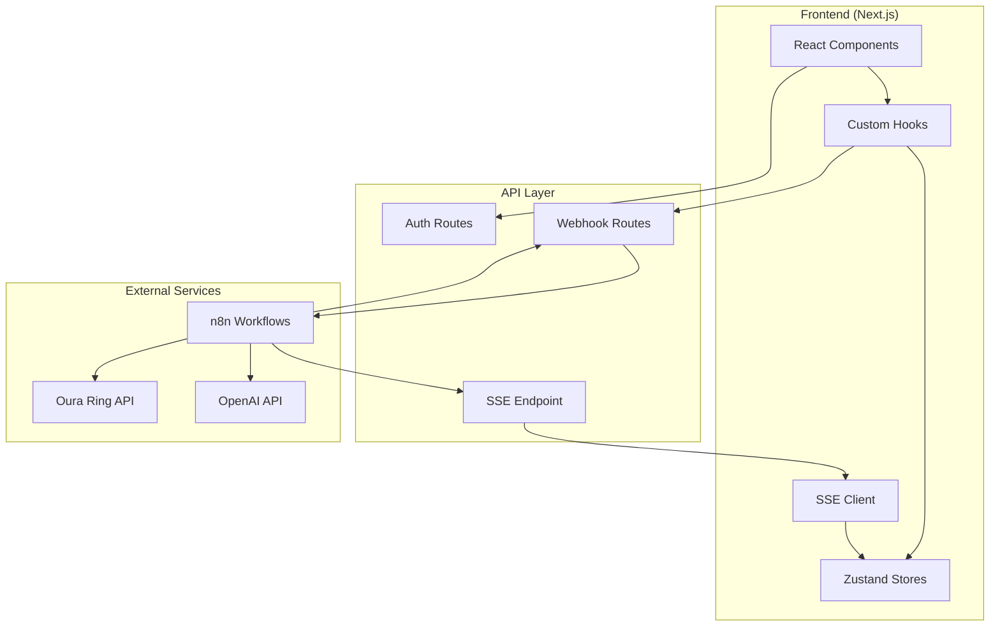
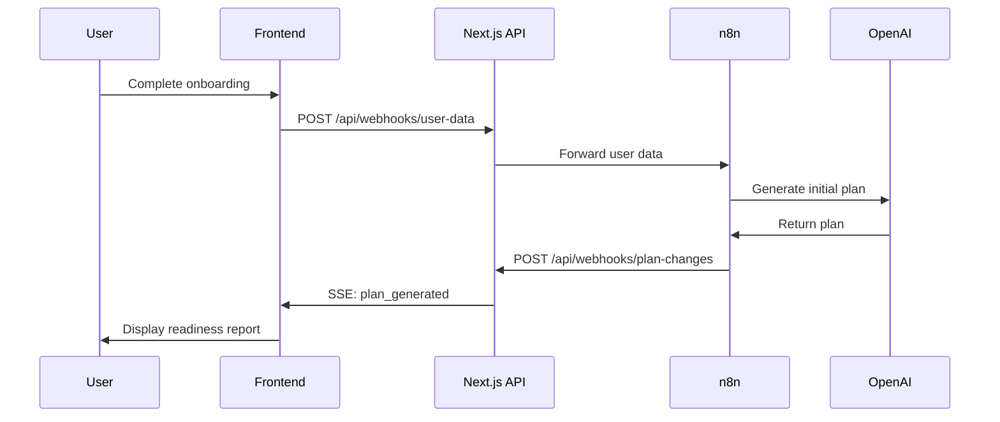
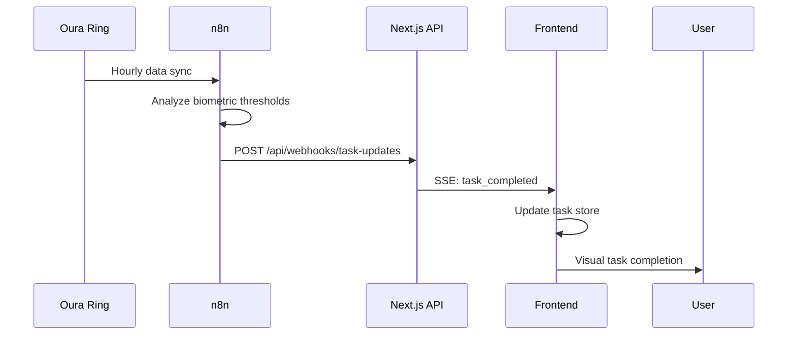

# Holistic Marathon Optimizer - System Architecture

## Table of Contents
1. [Overview](#overview)
2. [Current vs Proposed Structure](#current-vs-proposed-structure)
3. [System Architecture](#system-architecture)
4. [Technical Stack](#technical-stack)
5. [Design Patterns](#design-patterns)
6. [Component Relationships](#component-relationships)
7. [Data Flow](#data-flow)
8. [API Specifications](#api-specifications)
9. [Implementation Roadmap](#implementation-roadmap)
10. [Security Considerations](#security-considerations)

## Overview

### Project Summary
The Holistic Marathon Optimizer MVP is a personalized, adaptive marathon training agent delivered as a conversational web app. The architecture prioritizes rapid implementation while maintaining scalability and robustness for the demo deadline.

### Architectural Goals
- **Speed**: MVP ready for demo by 5:00 PM tomorrow
- **Simplicity**: Modular monolith for reduced complexity
- **Real-time**: Live updates via Server-Sent Events
- **Integration**: Seamless n8n and Oura Ring connectivity
- **Adaptability**: AI-driven plan modifications based on user feedback

## Current vs Proposed Structure

### Current Structure Issues
- Minimal component organization (only basic UI components)
- No API layer for n8n integration
- Missing real-time update infrastructure
- No state management for complex user data
- Lack of type definitions for external integrations

### Proposed Improvements
- Feature-based component organization
- Dedicated API routes for webhook endpoints
- Real-time update system with SSE
- Centralized state management with Zustand
- Comprehensive TypeScript type definitions
- Clear separation of concerns

## System Architecture

### Architecture Pattern: Modular Monolith with Event-Driven Updates



### Why This Architecture?

1. **Modular Monolith**: Single deployable unit reduces complexity for MVP timeline
2. **Event-Driven**: Perfect fit for n8n's webhook-based communication
3. **Real-time Capability**: SSE enables live updates without WebSocket complexity
4. **Scalability Path**: Can evolve to microservices post-MVP if needed

## Technical Stack

### Frontend
- **Framework**: Next.js 15 with App Router
- **Language**: TypeScript 5
- **State Management**: Zustand
- **UI Framework**: Radix UI + Tailwind CSS
- **Forms**: React Hook Form + Zod validation
- **Real-time**: Server-Sent Events

### Backend Integration
- **Orchestration**: n8n workflows
- **Database**: Google Sheets (via n8n)
- **Authentication**: Next-Auth or custom JWT
- **API Communication**: REST + Webhooks

### External Services
- **AI**: OpenAI API (via n8n)
- **Wearables**: Oura Ring API
- **Notifications**: Webhook-triggered SSE

## Design Patterns

### 1. Provider Pattern (React Context + Custom Hooks)
```typescript
// Example: useAuth hook
const useAuth = () => {
  const { user, login, logout } = useAuthStore();
  return { user, login, logout };
};

// Usage in components
const Dashboard = () => {
  const { user } = useAuth();
  // Component logic
};
```

**Benefits**:
- Centralizes state management
- Keeps components clean and testable
- Provides type-safe access to global state

### 2. Observer Pattern (via SSE + State Updates)
```typescript
// SSE connection that updates stores
const useRealTimeUpdates = () => {
  useEffect(() => {
    const eventSource = new EventSource('/api/sse');
    
    eventSource.onmessage = (event) => {
      const { type, data } = JSON.parse(event.data);
      
      switch (type) {
        case 'TASK_COMPLETED':
          taskStore.updateTask(data);
          break;
        case 'PLAN_UPDATED':
          planStore.updatePlan(data);
          break;
      }
    };
    
    return () => eventSource.close();
  }, []);
};
```

**Benefits**:
- Eliminates manual polling
- Ensures UI stays synchronized with backend state
- Provides responsive user experience

### 3. Repository Pattern (Client Abstractions)
```typescript
// n8n client abstraction
class N8NClient {
  async sendUserData(data: UserData): Promise<void> {
    await fetch('/api/webhooks/user-data', {
      method: 'POST',
      headers: { 'Content-Type': 'application/json' },
      body: JSON.stringify(data)
    });
  }
  
  async updateFeedback(feedback: Feedback): Promise<void> {
    // Implementation
  }
}
```

**Benefits**:
- Isolates external dependencies
- Enables easy testing and mocking
- Provides clean error handling

## Component Relationships

### Directory Structure
```
src/
├── app/                    # Next.js App Router pages
├── components/             # React components by feature
│   ├── ui/                # Reusable UI primitives
│   ├── chat/              # Chatbot components
│   ├── dashboard/         # Dashboard-specific components
│   ├── onboarding/        # Onboarding flow components
│   ├── plan/              # Training plan components
│   └── shared/            # Shared layout components
├── hooks/                 # Custom React hooks
├── stores/                # Zustand state stores
├── lib/                   # Utility libraries and clients
└── types/                 # TypeScript type definitions
```

### State Flow
```
User Interaction → Custom Hook → Zustand Store → Component Re-render
                              ↘ API Call → n8n Webhook
                                         ↘ n8n Processing
                                                ↘ Webhook Response → SSE Event → Store Update
```

## Data Flow

### User Onboarding Flow


### Real-time Task Updates


## API Specifications

### Webhook Endpoints

#### `/api/webhooks/task-updates`
```typescript
interface TaskUpdatePayload {
  userId: string;
  taskId: string;
  status: 'completed' | 'failed';
  completedBy: 'biometric' | 'manual';
  data?: {
    sleepScore?: number;
    steps?: number;
    readinessScore?: number;
  };
}
```

#### `/api/webhooks/plan-changes`
```typescript
interface PlanChangePayload {
  userId: string;
  planId: string;
  changes: {
    week: number;
    day: number;
    modifications: string[];
    rationale: string;
  };
  triggeredBy: 'feedback' | 'biometric' | 'ai_adaptation';
}
```

#### `/api/webhooks/user-data`
```typescript
interface UserDataPayload {
  userId: string;
  type: 'onboarding' | 'feedback' | 'chat';
  data: {
    responses?: OnboardingResponse[];
    feedback?: UserFeedback;
    message?: string;
  };
}
```

### Server-Sent Events

#### `/api/sse`
```typescript
interface SSEEvent {
  type: 'TASK_COMPLETED' | 'PLAN_UPDATED' | 'NOTIFICATION';
  userId: string;
  data: any;
  timestamp: string;
}
```

## Implementation Roadmap

### Phase 1: Foundation (0-2 hours)
- [ ] Setup enhanced directory structure
- [ ] Implement authentication system
- [ ] Create webhook API routes
- [ ] Setup SSE infrastructure
- [ ] Configure Zustand stores

### Phase 2: Core Features (2-6 hours)
- [ ] Build onboarding chatbot flow
- [ ] Implement dashboard with task management
- [ ] Create training plan views
- [ ] Setup Oura Ring integration
- [ ] Connect real-time updates

### Phase 3: Integration & Polish (6-8 hours)
- [ ] Complete n8n workflow integration
- [ ] Implement feedback loops
- [ ] Add comprehensive error handling
- [ ] UI polish and demo preparation
- [ ] Testing and bug fixes

### Critical Path Dependencies
1. **SSE Setup** → Real-time updates for all features
2. **Webhook Endpoints** → n8n integration
3. **State Management** → Component data flow
4. **Authentication** → User session management

## Security Considerations

### Authentication
- JWT-based session management
- Secure HTTP-only cookies
- OAuth integration for social login

### API Security
- Webhook signature verification
- Rate limiting on API endpoints
- Input validation with Zod schemas

### Data Protection
- HTTPS enforcement
- No PII in logs or client-side storage
- Secure Oura Ring token handling

### Environment Variables
```bash
# Authentication
NEXTAUTH_SECRET=your-secret-key
NEXTAUTH_URL=http://localhost:3000

# n8n Integration
N8N_WEBHOOK_URL=your-n8n-instance-url
N8N_API_KEY=your-n8n-api-key

# Oura Ring
OURA_CLIENT_ID=your-oura-client-id
OURA_CLIENT_SECRET=your-oura-client-secret

# OpenAI (if direct integration needed)
OPENAI_API_KEY=your-openai-key
```

## File Structure Implementation

```
holistic-marathon-optimizer/
├── src/
│   ├── app/
│   │   ├── layout.tsx
│   │   ├── page.tsx
│   │   ├── login/page.tsx
│   │   ├── onboarding/
│   │   │   ├── page.tsx
│   │   │   └── report/page.tsx
│   │   ├── dashboard/page.tsx
│   │   ├── plan/page.tsx
│   │   └── api/
│   │       ├── auth/route.ts
│   │       ├── sse/route.ts
│   │       └── webhooks/
│   │           ├── task-updates/route.ts
│   │           ├── plan-changes/route.ts
│   │           └── user-data/route.ts
│   ├── components/
│   │   ├── ui/ (existing Radix components)
│   │   ├── chat/
│   │   │   ├── ChatBot.tsx
│   │   │   ├── ChatMessage.tsx
│   │   │   └── ChatInput.tsx
│   │   ├── dashboard/
│   │   │   ├── TaskCard.tsx
│   │   │   ├── ProgressIndicator.tsx
│   │   │   └── InsightsPanel.tsx
│   │   ├── onboarding/
│   │   │   ├── OnboardingFlow.tsx
│   │   │   ├── ReadinessReport.tsx
│   │   │   └── OuraConnection.tsx
│   │   ├── plan/
│   │   │   ├── PlanView.tsx
│   │   │   ├── WeekView.tsx
│   │   │   └── FeedbackButtons.tsx
│   │   └── shared/
│   │       ├── Layout.tsx
│   │       └── Navigation.tsx
│   ├── hooks/
│   │   ├── useAuth.ts
│   │   ├── useRealTimeUpdates.ts
│   │   ├── useOuraData.ts
│   │   └── usePlanUpdates.ts
│   ├── stores/
│   │   ├── authStore.ts
│   │   ├── userStore.ts
│   │   ├── planStore.ts
│   │   └── taskStore.ts
│   ├── lib/
│   │   ├── utils.ts
│   │   ├── auth.ts
│   │   ├── n8n-client.ts
│   │   ├── oura-client.ts
│   │   ├── sse-client.ts
│   │   └── constants.ts
│   └── types/
│       ├── user.ts
│       ├── plan.ts
│       ├── task.ts
│       └── oura.ts
```

This architecture document serves as the technical blueprint for implementing the Holistic Marathon Optimizer MVP, ensuring all team members understand the system design and implementation approach. 